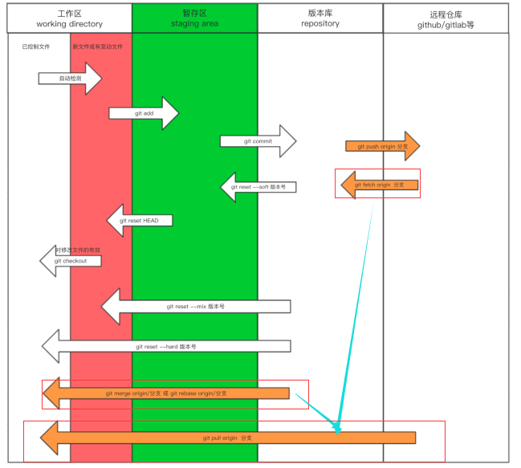

#### 添加远程库

要添加一个新的远程仓库，可以指定一个简单的名字，以便将来引用,命令格式如下：

```bash
git remote add [shortname] [url]
git remote add origin git@github.com:yourName/repositoryname.git
git remote add origin https://github.com/yourName/repositoryname.git  # 两种方式
```

关联之后可以用git remote -v 来检查是否关联成功

#### 克隆操作

将远程仓库（GitHub对应的项目）复制到本地

```bash
git clone https://github.com/Maker-Wu/Go-.git
```

从远程仓库更新文件

```bash
git pull origin master #从远程仓库的更改合并到当前分支中。相当于下面两个命令
git fetch origin master
git merge origin/master
```

```bash
git reset --hard origin/master  #强制使您的本地分支指向origin/master。通常情况下，您要放弃所做的本地修改并将本地分支保持为远程状态。
```



